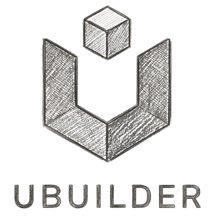
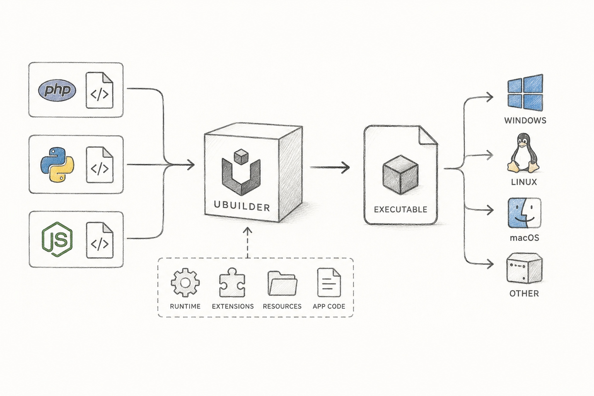

<p align="center">
  <picture>
    <source media="(prefers-color-scheme: dark)" srcset="docs/assets/logowhite.png">
    
  </picture>
</p>

<h1 align="center">UBuilder</h1>

<p align="center">
  Bundle Python, Node.js, or PHP apps into a single self-contained executable.
</p>

<p align="center">
  <a href="https://opensource.org/licenses/MIT"></a>
  <a href="https://github.com/developersharif/ubuilder/releases/latest"></a>
  
  
  
</p>

The output runs on any same-OS machine — no Python, Node, PHP, `pip`,
`npm`, or `composer` required on the target. The build machine doesn't
need a global interpreter either; `ubuilder`'s first run vendors pinned
runtime tarballs into `~/.cache/ubuilder/runtimes/` and embeds them
into every bundle.

```bash
cd my-app/                   # contains main.py + (optional) requirements.txt
ubuilder                     # produces one executable named after the dir
./my-app                     # runs anywhere with no Python installed
```

---

## Install

Choose your platform. Each option downloads the binary from the latest [GitHub Release](https://github.com/developersharif/ubuilder/releases/latest) and puts it on your `PATH`.

### Linux (x86_64)

```bash
curl -L https://github.com/developersharif/ubuilder/releases/latest/download/ubuilder-linux-amd64.tar.gz \
  | tar -xz
sudo mv ubuilder /usr/local/bin/
ubuilder --version
```

Or unprivileged, into `~/.local/bin`:

```bash
mkdir -p ~/.local/bin
curl -L https://github.com/developersharif/ubuilder/releases/latest/download/ubuilder-linux-amd64.tar.gz \
  | tar -xz -C ~/.local/bin ubuilder
# add ~/.local/bin to PATH if it isn't already
```

### macOS (Apple Silicon)

```bash
curl -L https://github.com/developersharif/ubuilder/releases/latest/download/ubuilder-macos-amd64.tar.gz \
  | tar -xz
sudo mv ubuilder /usr/local/bin/
xattr -d com.apple.quarantine /usr/local/bin/ubuilder 2>/dev/null || true
ubuilder --version
```

The `xattr` line removes Gatekeeper's quarantine flag on the downloaded binary.

Intel Macs: the published `ubuilder-macos-amd64.tar.gz` is actually an
arm64 binary today (the CI macOS runner is `macos-15-arm64`; the
`-amd64` suffix in the asset name is a naming carryover). If you're on
an Intel Mac, [build from source](#from-source-all-platforms) instead.

### Windows (x86_64)

PowerShell:

```powershell
$url = "https://github.com/developersharif/ubuilder/releases/latest/download/ubuilder-windows-amd64.zip"
Invoke-WebRequest -Uri $url -OutFile "$env:TEMP\ubuilder.zip"
Expand-Archive -Path "$env:TEMP\ubuilder.zip" -DestinationPath "$env:USERPROFILE\ubuilder" -Force
$env:Path += ";$env:USERPROFILE\ubuilder"
ubuilder --version
```

To persist `PATH`: **System Properties → Environment Variables → Path → add `%USERPROFILE%\ubuilder`**, or run once:

```powershell
[Environment]::SetEnvironmentVariable("Path", $env:Path, "User")
```

### From source (all platforms)

Requires CMake ≥ 3.16, a C11/C++17 compiler (GCC/Clang/MSVC), and `zlib` headers.

```bash
git clone https://github.com/developersharif/ubuilder.git
cd ubuilder
mkdir -p build && cd build
cmake -DCMAKE_BUILD_TYPE=Release ..
cmake --build . -j
sudo cp src/ubuilder /usr/local/bin/         # or wherever you like
```

See [Build from source](#build-from-source) below for CMake options.

---

## Quick start

You only need **two things** in your project directory:

1. The app itself (`main.py`, `main.js`, `main.php`, or `index.*`).
2. A `ubuilder.json` manifest — or just let `ubuilder` write one for you on the first build.

### Python

```bash
mkdir hello-py && cd hello-py
cat > main.py <<'EOF'
import sys
print(f"Hello from Python, args: {sys.argv[1:]}")
EOF

ubuilder                                # auto-writes ubuilder.json on first run
./dist/hello-py world                   # default output is dist/<project-dir-basename>
# → Hello from Python, args: ['world']
```

With dependencies:

```bash
cat > requirements.txt <<'EOF'
attrs==23.2.0
EOF
ubuilder                                # pip-installs attrs into the bundle
./dist/hello-py
```

### Node.js

```bash
mkdir hello-node && cd hello-node
cat > main.js <<'EOF'
console.log("Hello from Node, args:", process.argv.slice(2));
EOF
echo '{"runtime":"node","entry_point":"main.js"}' > ubuilder.json

ubuilder
./dist/hello-node world
```

With dependencies:

```bash
cat > package.json <<'EOF'
{ "dependencies": { "picocolors": "1.1.1" } }
EOF
ubuilder                                # npm-installs into the staged project
```

### PHP

```bash
mkdir hello-php && cd hello-php
cat > main.php <<'EOF'
<?php
echo "Hello from PHP, args: " . implode(",", array_slice($argv, 1)) . "\n";
EOF
echo '{"runtime":"php","entry_point":"main.php"}' > ubuilder.json

ubuilder
./dist/hello-php world
```

With Composer:

```bash
cat > composer.json <<'EOF'
{
  "require": { "psr/log": "^1.1" }
}
EOF
ubuilder                                # composer install runs in a staged copy
```

PHP bundles work only on machines with PHP's shared libraries installed (`libxml2`, `libssl`, `libsodium`, …). For most servers this is a non-issue (any host with `php-cli` available). See [Status](#status) for the libxml2 SONAME caveat.

---

## Usage examples

### Drop files from the bundle

```bash
# Exclude tests/ docs/ and *.md files from the embedded app tree
ubuilder --exclude='tests/**' --exclude='docs/**' --exclude='*.md'
```

Or in `ubuilder.json`:

```json
{
  "runtime": "python",
  "entry_point": "main.py",
  "exclude": ["tests/**", "docs/**", "*.md"]
}
```

### Drop a dependency from the install

```bash
ubuilder --exclude=six                  # Python: filters requirements.txt
ubuilder --exclude=is-number            # Node:   filters package.json
ubuilder --exclude=ext-curl             # PHP:    drops composer ext-* + passes --ignore-platform-req
```

### Use a specific vendored interpreter

```bash
# Point at a directory you control instead of the cache
ubuilder --runtime-source=/opt/my-python/

# Or use the host's installed interpreter (NOT portable — for dev only)
ubuilder --use-host-runtime
```

### Skip dependency installation entirely

```bash
ubuilder --no-install-deps              # use pre-existing vendor/ or node_modules/
```

### Build verbose / inspect what's happening

```bash
ubuilder --verbose                      # show every spawned subprocess
```

### Build into a specific path

By default the bundle goes to `dist/<project-dir-basename>` and the
output tree is auto-excluded from itself so you can re-run `ubuilder`
freely. Override:

```bash
ubuilder --output=dist/myapp            # explicit path under dist/
ubuilder --output=/opt/builds/myapp     # absolute path, anywhere
```

### See all flags

```bash
ubuilder --help
```

---

## `ubuilder.json` manifest

Minimum:

```json
{ "runtime": "python", "entry_point": "main.py" }
```

Full schema (every field optional except `runtime` + `entry_point`):

```json
{
  "schema_version": 1,
  "name": "my-app",
  "runtime": "python",
  "entry_point": "main.py",
  "output": "dist/my-app",
  "exclude": ["tests/**", "*.md", "six"],
  "verbose": false,
  "gui": false,
  "compression": true,
  "runtime_options": {
    "python": { "source": "/opt/cpython-3.12", "use_host": false }
  }
}
```

- **CLI flags override config keys** — except `--exclude`, which **appends** to the config's `exclude` array.
- **Auto-write**: a successful build with no `ubuilder.json` writes one with the resolved `runtime`, `entry_point`, `name`, and `exclude`. The next `ubuilder` run needs no flags.

Full schema docs: [`docs/internals/architecture/CONFIG_FILE_SPEC.md`](docs/internals/architecture/CONFIG_FILE_SPEC.md).

---

## CLI flags

The zero-flag path is the default. Pass these for non-default cases:

| Flag | Purpose |
|------|---------|
| `--project-dir <path>` | Build from a directory other than `.` |
| `--runtime <python\|php\|node>` | Override the manifest's runtime |
| `--output <path>` | Output executable path (default: `dist/<project-dir-basename>`) |
| `--entry-point <file>` | Override the manifest's entry point |
| `--config <path>` | Use an explicit `ubuilder.json` |
| `--runtime-source <path>` | Use a specific vendored interpreter tree |
| `--use-host-runtime` | Use the host's interpreter (bundle will **not** be portable) |
| `--no-install-deps` | Skip `pip` / `npm` / `composer install` |
| `--no-auto-vendor` | Don't auto-spawn `scripts/vendor-runtimes.sh` on cache miss |
| `--exclude <pat>` (repeatable) | Drop a file glob, PHP ext, Python wheel, or Node module |
| `--self-update` | Download the latest ubuilder release and replace this binary |
| `--verbose` / `-v` | Show every spawned subprocess |
| `--version` / `-V` | Print the ubuilder version |
| `--help` / `-h` | Show all flags |

---

## Status

| Runtime | Linux | macOS | Windows | Notes |
|---|---|---|---|---|
| **Python** | ✅ Hermetic | ✅ Hermetic | ✅ Host | Tier-3 Docker isolation passing on Linux + macOS |
| **Node.js** | ✅ Hermetic | ✅ Hermetic | ✅ Host | Tier-3 Docker isolation passing on Linux + macOS |
| **PHP** | ✅ Host-bits hermetic | ⚠️ Roadmap | ✅ Host | M1-D Linux ships embedded `bin/php` + composer extensions |

Known limitations:

- PHP cross-distro portability: bundles include the host's `libxml2.so.<N>`.
  Build on the same distro family as your deployment target. Ubuntu 24.10+
  and Debian Trixie+ both ship `libxml2.so.16`; older distros ship `.so.2`.
- PHP on macOS: the synthetic-runtime path assumes a Linux `extension_dir`
  layout; Homebrew's Cellar isn't handled yet. The macOS example build
  skips the PHP fixture with a clear message.
- Windows: bundles use the host's `python.exe` / `node.exe` / `php.exe`
  rather than a vendored hermetic tree. Hermetic Windows is on the roadmap.

Full roadmap: [`docs/internals/architecture/ROADMAP_NEXT.md`](docs/internals/architecture/ROADMAP_NEXT.md).

---

## How it works

<p align="center">
  
</p>

UBuilder is one C binary with two modes, distinguished at startup:

1. **Build mode** (no embedded payload): parse CLI + `ubuilder.json` → pick a runtime builder → write a new executable laid out as
   `[ubuilder launcher][runtime tree][app tree][V4 trailer with SHA-256]`.
2. **Launcher mode** (payload present): detect the trailer, verify the SHA-256, extract the payload to a temp dir, `exec` the embedded interpreter against the embedded entry point, clean up on exit.

User dependencies (`requirements.txt`, `package.json`, `composer.json`) are installed into a **staged copy** of the runtime/project before bundling — the shared cache is never polluted. Successful installs are content-addressed by SHA-256(manifest + lockfile) and replayed from cache on the next build.

Deep dives:

- [`docs/internals/architecture/ARCHITECTURE_AUDIT.md`](docs/internals/architecture/ARCHITECTURE_AUDIT.md) — engineering audit + hermeticity principles
- [`docs/internals/architecture/M1_HERMETIC_INTERPRETERS.md`](docs/internals/architecture/M1_HERMETIC_INTERPRETERS.md) — vendoring strategy + `--runtime-source` precedence
- [`docs/internals/architecture/M8_USER_DEPS.md`](docs/internals/architecture/M8_USER_DEPS.md) — per-runtime dep-install mechanics
- [`docs/internals/architecture/CONFIG_FILE_SPEC.md`](docs/internals/architecture/CONFIG_FILE_SPEC.md) — full `ubuilder.json` schema
- [`docs/internals/architecture/STATIC_LAUNCHER.md`](docs/internals/architecture/STATIC_LAUNCHER.md) — `-DUBUILDER_STATIC=ON` for a fully static launcher (musl toolchain provided)

---

## Build from source

```bash
git clone https://github.com/developersharif/ubuilder.git
cd ubuilder
mkdir -p build && cd build
cmake -DCMAKE_BUILD_TYPE=Release ..
cmake --build . -j

./tests/test_ubuilder                       # 184/184 unit tests
../tests/bundle/run-bundle-tests.sh         # 13/13 end-to-end bundle cases
../tests/bundle/run-tier3.sh                # 4/4 Docker portability cases (Python + Node hermetic; PHP host-bits-hermetic)
```

Useful CMake options:

| Option | Purpose |
|---|---|
| `-DBUILD_TESTS=OFF` | Skip building the test binary |
| `-DENABLE_COMPRESSION=OFF` | Disable ZLIB resource compression |
| `-DUBUILDER_STATIC=ON -DCMAKE_TOOLCHAIN_FILE=../toolchains/musl-linux-x86_64.cmake` | Build a fully static launcher against musl |

After building, install the binary wherever you like (`/usr/local/bin`, `~/.local/bin`, etc.).

---

## Contributing

Contributions welcome! Start with [`CONTRIBUTING.md`](CONTRIBUTING.md) for development setup, code conventions, and the PR workflow.

A typical contributor loop:

```bash
git clone https://github.com/developersharif/ubuilder.git
cd ubuilder
mkdir -p build && cd build && cmake .. && cmake --build . -j
./tests/test_ubuilder                       # all green before changes
# ... make a change ...
cmake --build . -j && ./tests/test_ubuilder
../tests/bundle/run-bundle-tests.sh         # before PR
```

Areas where help is most welcome:

- **Hermetic PHP on Linux** without the libxml2 SONAME caveat (ldd-driven shared-lib bundling).
- **Hermetic PHP on macOS** — adapt `src/runtimes/php_builder.c`'s M1-D synthesis to Homebrew's Cellar layout.
- **Hermetic Windows runtimes** — vendor a portable Python / Node tree like Linux/macOS already do.
- **Lockfile reproducibility** for Python (`requirements.lock`) and PHP (`composer.lock`-driven `--no-deps`).
- **More tier-3 backends** — e.g. `nix-shell` for fully reproducible Tier-3 tests.

If you find a bug, please open an issue with:
- The command you ran
- Full `--verbose` output
- Your `ubuilder.json` (if any)
- Host OS + distro version
- `ubuilder --version`

---

## Project layout

```
ubuilder/
├── src/
│   ├── core/                    # ubuilder.{c,h}, platform_compat, json_mini, config, sha256, glob_match
│   ├── runtimes/                # {python,php,nodejs}_{builder,runtime}.c + runtime_embedder, install_cache
│   └── main.c                   # CLI entry; routes builder vs launcher mode
├── scripts/
│   └── vendor-runtimes.sh       # SHA-pinned interpreter downloader (Linux + macOS)
├── tests/
│   ├── test_*.c                 # unit tests (test_ubuilder binary)
│   └── bundle/                  # end-to-end bundle + Tier-3 isolation harness
├── examples/{python,php,nodejs}/
├── toolchains/                  # CMake toolchain files (musl-linux-x86_64)
└── docs/                        # architecture audit, M1, M8, config spec, roadmap, CLI reference
```

---

## License

MIT — see [LICENSE](LICENSE).
