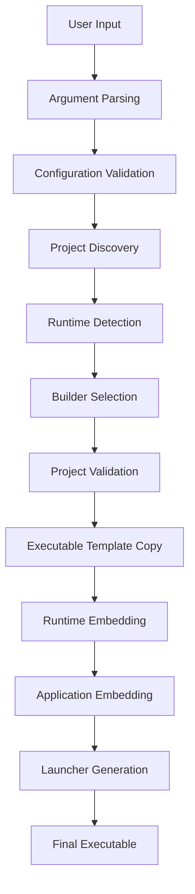
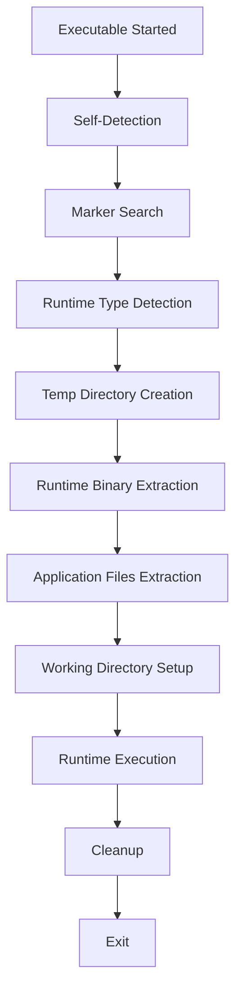

# UBuilder Architecture Overview

## 🏗️ System Architecture

UBuilder follows a modular, extensible architecture designed for cross-platform compatibility and runtime flexibility.

```
┌─────────────────────────────────────────────────────────────┐
│                        UBuilder Core                        │
├─────────────────────────────────────────────────────────────┤
│                     CLI Interface                           │
│  ┌─────────────────┐  ┌─────────────────┐  ┌─────────────────┐│
│  │ Argument Parser │  │ Configuration   │  │ Output Manager  ││
│  │                 │  │ Validator       │  │                 ││
│  └─────────────────┘  └─────────────────┘  └─────────────────┘│
├─────────────────────────────────────────────────────────────┤
│                   Build Pipeline                            │
│  ┌─────────────────┐  ┌─────────────────┐  ┌─────────────────┐│
│  │ Project Scanner │  │ Runtime Builder │  │ Executable      ││
│  │                 │  │ Registry        │  │ Generator       ││
│  └─────────────────┘  └─────────────────┘  └─────────────────┘│
├─────────────────────────────────────────────────────────────┤
│                Runtime Embedder System                      │
│  ┌─────────────────┐  ┌─────────────────┐  ┌─────────────────┐│
│  │ Binary Detector │  │ Runtime Embedder│  │ Extraction      ││
│  │                 │  │                 │  │ Manager         ││
│  └─────────────────┘  └─────────────────┘  └─────────────────┘│
├─────────────────────────────────────────────────────────────┤
│                Runtime-Specific Builders                    │
│  ┌─────────────────┐  ┌─────────────────┐  ┌─────────────────┐│
│  │ PHP Builder     │  │ Python Builder  │  │ Node.js Builder ││
│  │                 │  │                 │  │                 ││
│  └─────────────────┘  └─────────────────┘  └─────────────────┘│
└─────────────────────────────────────────────────────────────┘
```

## 📦 Core Components

### 1. CLI Interface Layer

**Location:** `src/main.c`  
**Responsibility:** Command-line argument parsing and user interaction

- **Argument Parser**: Processes command-line options
- **Configuration Validator**: Validates project structure and runtime availability
- **Output Manager**: Handles user feedback and error reporting

### 2. Core Framework Layer

**Location:** `src/core/ubuilder.{h,c}`  
**Responsibility:** Central orchestration and cross-platform abstractions

- **Build Pipeline Controller**: Manages the overall build process
- **Platform Abstraction**: Handles OS-specific operations
- **Error Management**: Centralized error handling and reporting

### 3. Runtime Builder System

**Location:** `src/runtimes/runtime_builder.{h,c}`  
**Responsibility:** Extensible runtime support framework

- **Builder Registry**: Manages available runtime builders
- **Builder Interface**: Standardized API for runtime-specific operations
- **Validation Framework**: Project validation for each runtime

### 4. Runtime Embedder System

**Location:** `src/runtimes/runtime_embedder.{h,c}`  
**Responsibility:** True runtime embedding capabilities

- **Binary Detection**: Automatically finds system runtime binaries
- **Binary Embedding**: Embeds complete runtime interpreters
- **Extraction System**: Runtime extraction and execution

### 5. Runtime-Specific Builders

**Location:** `src/runtimes/{php,python,nodejs}_builder.c`  
**Responsibility:** Language-specific build logic

Each builder implements:

- Project validation
- Runtime embedding
- Application packaging
- Launcher generation

## 🔄 Build Process Flow



### Phase 1: Initialization

1. **Argument Parsing**: Process CLI arguments and validate required parameters
2. **Configuration Loading**: Load project configuration and validate settings
3. **Environment Check**: Verify build environment and dependencies

### Phase 2: Discovery

1. **Project Scanning**: Analyze project structure and detect entry points
2. **Runtime Detection**: Locate system runtime binaries and check versions
3. **Builder Selection**: Choose appropriate runtime builder

### Phase 3: Validation

1. **Project Validation**: Runtime-specific project structure validation
2. **Dependency Check**: Verify all required files are present
3. **Compatibility Check**: Ensure runtime and project compatibility

### Phase 4: Building

1. **Template Creation**: Copy UBuilder executable as base template
2. **Runtime Embedding**: Embed complete runtime interpreter
3. **Application Packaging**: Bundle all project files
4. **Metadata Generation**: Create execution metadata

### Phase 5: Finalization

1. **Launcher Integration**: Embed runtime-specific launcher
2. **Marker Insertion**: Add embedded data markers
3. **Permission Setting**: Set executable permissions
4. **Verification**: Validate final executable

## 🔍 Runtime Execution Flow



### 1. Self-Detection Phase

- **Executable Analysis**: Check if current process is an embedded UBuilder app
- **Marker Search**: Look for embedded data markers in executable
- **Format Detection**: Distinguish between true embedding and launcher formats

### 2. Extraction Phase

- **Temp Directory Creation**: Create isolated execution environment
- **Runtime Extraction**: Extract embedded interpreter binary
- **Application Extraction**: Extract all project files
- **Permission Setup**: Set proper file permissions

### 3. Execution Phase

- **Working Directory**: Change to extracted application directory
- **Runtime Invocation**: Execute embedded interpreter with application
- **Argument Forwarding**: Pass command-line arguments to application

### 4. Cleanup Phase

- **Temp File Removal**: Clean up extracted files
- **Resource Release**: Free allocated memory and handles
- **Exit Code Forwarding**: Return application exit code

## 🔧 Extensibility Points

### Adding New Runtime Support

1. **Create Builder Implementation**:

```c
// src/runtimes/mylang_builder.c
static ub_result_t mylang_validate_project(const char* project_dir) {
    // Validation logic
}

static ub_result_t mylang_embed_runtime(FILE* output_file) {
    // Runtime embedding logic
}

const ub_runtime_builder_t mylang_builder = {
    .runtime_type = UB_RUNTIME_MYLANG,
    .name = "MyLang",
    .description = "MyLang runtime builder",
    .validate_project = mylang_validate_project,
    .embed_runtime = mylang_embed_runtime,
    // ... other functions
};
```

2. **Register in Builder Registry**:

```c
// src/runtimes/runtime_builder.c
static const ub_runtime_builder_t* g_builders[] = {
    &python_builder,
    &php_builder,
    &nodejs_builder,
    &mylang_builder,  // Add new builder
    NULL
};
```

3. **Add Runtime Type**:

```c
// src/core/ubuilder.h
typedef enum {
    UB_RUNTIME_UNKNOWN = -1,
    UB_RUNTIME_PYTHON = 0,
    UB_RUNTIME_PHP = 1,
    UB_RUNTIME_NODEJS = 2,
    UB_RUNTIME_MYLANG = 3,  // Add new type
} ub_runtime_type_t;
```

### Custom Build Hooks

The architecture supports custom build hooks for advanced scenarios:

```c
typedef struct {
    ub_result_t (*pre_build_hook)(const ub_config_t* config);
    ub_result_t (*post_build_hook)(const char* output_path);
    ub_result_t (*pre_runtime_embed_hook)(FILE* output_file);
    ub_result_t (*post_runtime_embed_hook)(FILE* output_file);
} ub_build_hooks_t;
```

## 📊 Performance Characteristics

### Build Time Complexity

- **Small Projects (<10 files)**: O(n) where n = number of files
- **Large Projects (>100 files)**: O(n log n) due to directory traversal
- **Runtime Embedding**: O(r) where r = runtime binary size

### Memory Usage

- **Build Process**: ~10MB base + runtime size
- **Runtime Execution**: ~5MB overhead + application memory

### Storage Efficiency

- **PHP**: ~100:1 compression ratio (54KB → 6MB includes full PHP)
- **Python**: ~20:1 compression ratio (application → embedded size)
- **Node.js**: ~1:1 ratio due to large Node.js binary

## 🔒 Security Considerations

### Build-Time Security

- **Binary Verification**: Checksums of embedded runtime binaries
- **Path Validation**: Prevent directory traversal attacks
- **Permission Isolation**: Temporary files created with minimal permissions

### Runtime Security

- **Isolated Execution**: Extracted files in temporary, restricted directories
- **Cleanup Guarantee**: Automatic cleanup even on abnormal termination
- **Permission Drop**: No elevated privileges during execution

### Distribution Security

- **Code Signing**: Support for executable signing (future)
- **Integrity Checks**: Embedded checksums for tamper detection
- **Reproducible Builds**: Deterministic build process

## 🔮 Future Architecture Enhancements

### Planned Improvements

1. **Compression System**: Runtime and application compression
2. **Plugin Architecture**: Dynamic runtime plugin loading
3. **Resource Bundling**: Advanced asset management
4. **Cross-Compilation**: Build for different target platforms
5. **Package Management**: Integration with language package managers
